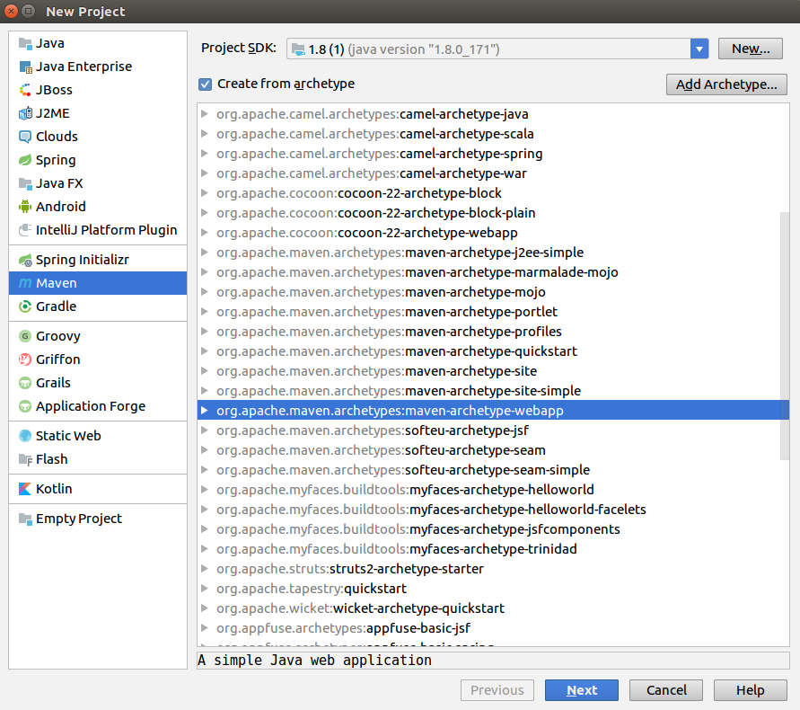
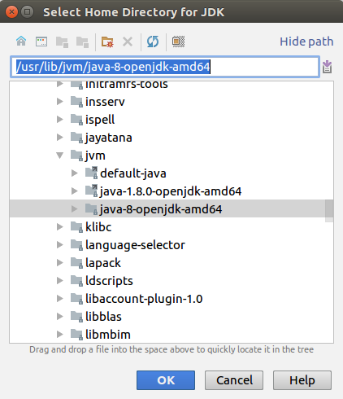
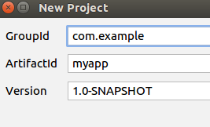
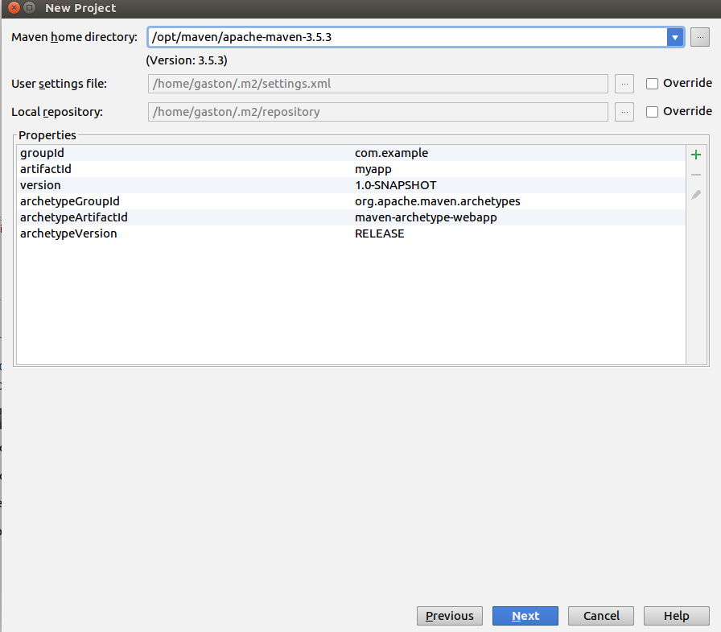
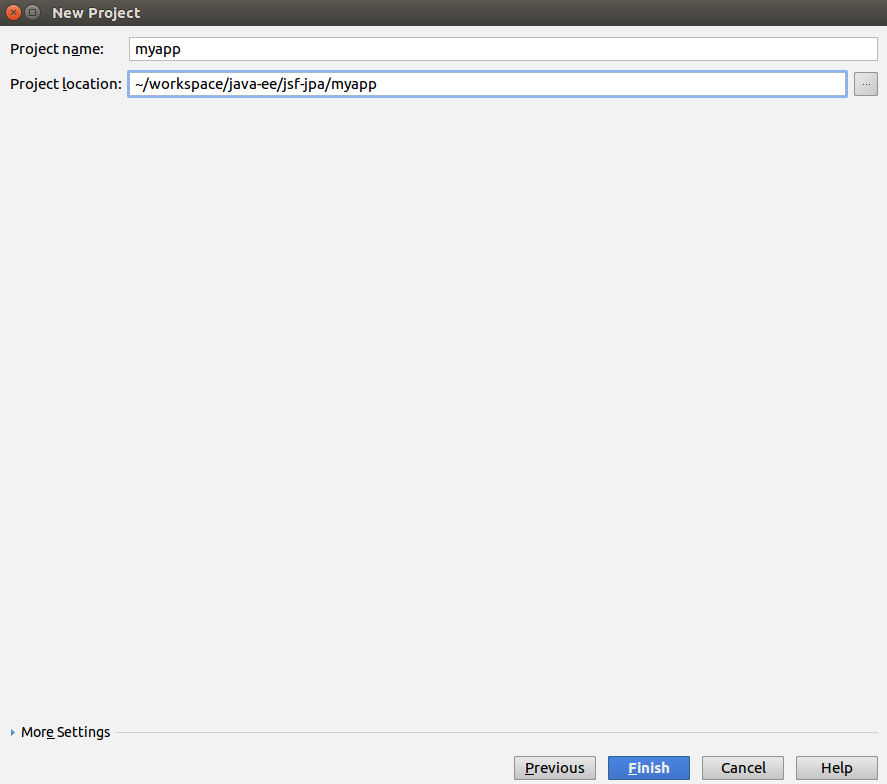
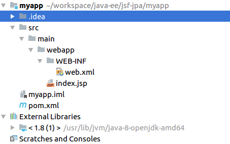
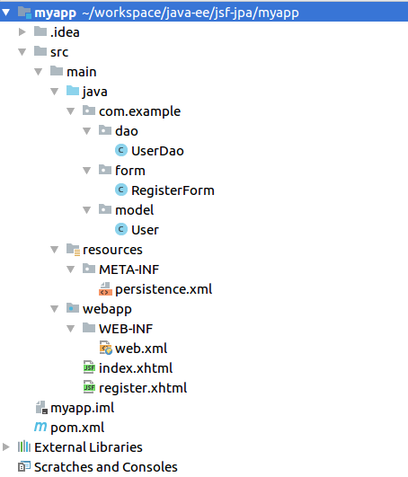
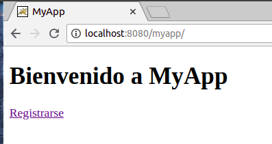
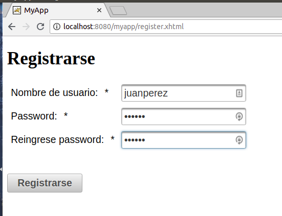
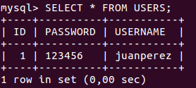

# Java EE: JSF & JPA
En este documento se explica como implementar una aplicación web utilizando las herramientas JSF (Java Server Faces) y JPA (Java Persistence API).

## Requerimientos
Se requiere tener instalado:
 - [Java 8 SE](http://www.oracle.com/technetwork/java/javase/downloads/index.html)
 - [Tomcat 9](https://tomcat.apache.org/download-90.cgi)
 - [Maven 3.5.3](https://maven.apache.org/)
 - [MySQL Server](https://dev.mysql.com/doc/refman/8.0/en/linux-installation.html)
 - No es un requisito, pero en este documento se explcarán los pasos utilizando el IDE [IntelliJ IDEA](https://www.jetbrains.com/idea/)

## 1. Crear el proyecto

En IntelliJ, ir a **_File->New->Proyect_** y elegir la opción **_Maven_**. Elegir el SDK 1.8, tildar la opción **_Create from archetype_** y elegir **_maven-archetype-webapp_**.




En caso de no tener el SDK configurado, hacer click en **_New_** y elegir el directorio donde está instalado Java.




Hacer click en **_Next_**, y en la siguiente pantalla elegir el GroupId, ArtifactId y Version, que seran los atributos de nuestro proyecto Maven.




Hacer click en **_Next_**, y elegir el directorio donde está instalado Maven.




Hacer click en next **_Next_**, elegir un nombre y una ubicación para el proyecto, y hacer click en **_Finish_**




Finalmente, deberiamos tener un proyecto creado con la siguiente estructura:



## 2. Agregar dependencias
El primer paso será agregar las dependencias necesarias en el pom.xml. En este caso necesitamos las dependencias de JSF, PrimeFaces (libreria de componentes de JSF), y Hibernate (la implementación que usaremos de JPA). Para esto, en `pom.xml` agregar las siguientes dependencias dentro del tag `<dependencies>` (si ya habían otras dependencias en el pom.xml como por ejemplo junit, no hace falta borrarlas):
```xml
<dependencies>
    <!--JSF-->
    <dependency>
        <groupId>com.sun.faces</groupId>
        <artifactId>jsf-api</artifactId>
        <version>2.1.13</version>
    </dependency>
    <dependency>
        <groupId>com.sun.faces</groupId>
        <artifactId>jsf-impl</artifactId>
        <version>2.1.13</version>
    </dependency>

    <!--PrimeFaces (libreria de componentes para JSF)-->
    <dependency>
        <groupId>org.primefaces</groupId>
        <artifactId>primefaces</artifactId>
        <version>6.2</version>
    </dependency>

    <!--JPA-->
    <dependency>
        <groupId>org.hibernate</groupId>
        <artifactId>hibernate-core</artifactId>
        <version>5.3.1.Final</version>
    </dependency>
    <dependency>
        <groupId>mysql</groupId>
        <artifactId>mysql-connector-java</artifactId>
        <version>8.0.11</version>
    </dependency>
</dependencies>
```
Para que se importen las dendencias al projecto, hacer click derecho sobre el projecto, y hacer click en **_Maven->Reimport_**
## 3. Crear el modelo
El siguiente paso será crear nuestro modelo de datos. Para esto, dentro del directorio `src/main` crear un directorio `java`. Hacer click derecho sobre este directorio, y hacer click en **_Mark Directory as->Sources Root_**. Luego, crear un nuevo paquete en el directorio `java` con el nombre `com.example.model`, y dentro de este paquete crear una clase Java con nombre `User`. Esta clase tendrá dos atributos `username` y `password` de tipo `String`. Además, agregamos getters y setters para dichos atributos.
```java
package com.example.model;

public class User {
    private String username;
    private String password;

    public String getUsername() {
        return username;
    }

    public void setUsername(String username) {
        this.username = username;
    }

    public String getPassword() {
        return password;
    }

    public void setPassword(String password) {
        this.password = password;
    }
}
```
Ahora agregaremos los Annotations de JPA para poder mappear esta clase a nuestra DB:
```java
import javax.persistence.*;

@Entity
@Table(name = "USERS")
public class User {

    @Id
    @GeneratedValue(strategy = GenerationType.AUTO)
    @Column(name = "ID")
    private int id;

    @Column(name = "USERNAME")
    private String username;

    @Column(name = "PASSWORD")
    private String password;
    ...
}
```
## 4. Configuración de JPA
El próximo paso será configurar JPA en nuestro proyecto. Para eso, dentro del directorio `src/main` crear un directorio `resources`. Hacer click derecho sobre este directorio, y hacer click en **_Mark Directory as->Resources Root_**. Dentro del directorio `resources`, crear un nuevo directorio `META-INF`, y dentro de este crear un archivo `persistence.xml`.
Dentro de este archivo, agregar lo siguiente:
```xml
<persistence xmlns="http://java.sun.com/xml/ns/persistence"
             xmlns:xsi="http://www.w3.org/2001/XMLSchema-instance"
             xsi:schemaLocation="http://java.sun.com/xml/ns/persistence http://java.sun.com/xml/ns/persistence/persistence_2_0.xsd"
             version="2.0">

    <!--Archivo de configuracion de JPA-->

    <persistence-unit name="my-unit" transaction-type="RESOURCE_LOCAL">

        <!--Proveedor que utilizamos como implementacion de JPA (en este caso Hibernate)-->
        <provider>org.hibernate.jpa.HibernatePersistenceProvider</provider>

        <!--Clases (Entities) que forman parte de esta persistence unit-->
        <class>com.example.model.User</class>

        <!--Configuraciones de conexion con la DB-->
        <properties>
            <property name="javax.persistence.jdbc.user" value="root"/>
            <property name="javax.persistence.jdbc.password" value="mysql"/>
            <property name="javax.persistence.jdbc.url" value="jdbc:mysql://localhost:3306/myapp"/>
            <property name="javax.persistence.jdbc.driver" value="com.mysql.jdbc.Driver"/>
            <property name="hibernate.dialect" value="org.hibernate.dialect.MySQL5Dialect"/>
            <property name="hibernate.hbm2ddl.auto" value="update"/>
            <property name="hibernate.show_sql" value="true"/>
        </properties>
    </persistence-unit>
</persistence>
```
En esta configuración creamos nuestra persistence-unit `my-unit`, y dentro de ella especificamos el provider de JPA a utilizar (Hibernate), las clases que vamos a persistir (en este caso una sola, `com.example.model.User`), y la configuración de conexión con la base de datos. 

## 5. Creación de un Dao
En este paso crearemos una clase DAO (Data Access Object) para encapsular las operaciones de acceso a la base de datos mediante JPA. Dentro del directorio `java` crear un paquete `com.example.dao`, y dentro crear una clase `UserDao` con el siguiente contenido:
```java
package com.example.dao;

import com.example.model.User;
import javax.persistence.EntityManager;
import javax.persistence.EntityManagerFactory;
import javax.persistence.Persistence;

public class UserDao {

    private final EntityManagerFactory entityManagerFactory;
    private final EntityManager entityManager;

    public UserDao() {
        entityManagerFactory = Persistence.createEntityManagerFactory("my-unit");
        entityManager = entityManagerFactory.createEntityManager();
    }

    public void add(User user) {
        entityManager.getTransaction().begin();
        entityManager.persist(user);
        entityManager.getTransaction().commit();
    }

    public void close() {
        entityManager.close();
        entityManagerFactory.close();
    }
}
```
En esta clase tenemos dos atributos, un `EntityManagerFactory`, que es usado para crear un `EntityManager`. Notar que el `EntityManagerFactory` se crea haciendo referencia al persistence-unit `my-unit` declarado previamente en el `persistence.xml`. A su vez, tenemos un método `add`, en el cual recibimos un `User` y lo agregamos a la base de datos utilizando el `EntityManager`. Y finalmente un método close para cerrar el `EntityManager` y el `EntityManagerFactory`.
## 6. Configuración de JSF
Para configurar JSF en nuestro proyecto, dentro del `web.xml` reemplazar el contenido dentro de `<web-app>` por lo siguiente:
```xml
<web-app>
    <display-name>My App</display-name>

    <servlet>
        <servlet-name>faces</servlet-name>
        <servlet-class>javax.faces.webapp.FacesServlet</servlet-class>
        <load-on-startup>1</load-on-startup>
    </servlet>

    <servlet-mapping>
        <servlet-name>faces</servlet-name>
        <url-pattern>*.xhtml</url-pattern>
    </servlet-mapping>

    <welcome-file-list>
        <welcome-file>index.xhtml</welcome-file>
    </welcome-file-list>

</web-app>
```
Esto configura el Servlet de JSF para que tome todos los requests que vayan a una URL *.xhtml.

## 7. Creación de un ManagedBean
Para poder recibir los parámetros de algún request, debemos crear un ManagedBean. Para eso, crear un nuevo paquete en el directorio `java` con nombre `com.example.form`, y dentro de este paquete crear una clase con nombre `RegisterForm`:
```java
package com.example.form;

import com.example.dao.UserDao;
import com.example.model.User;
import javax.annotation.PreDestroy;
import javax.faces.bean.ManagedBean;

@ManagedBean
public class RegisterForm {

    private UserDao userDao;
    private User user;

    public RegisterForm() {
        user = new User();
        userDao = new UserDao();
    }

    public String register() {
        userDao.add(user);
        return "index?faces-redirect=true";
    }

    public User getUser() {
        return user;
    }

    public void setUser(User user) {
        this.user = user;
    }

    @PreDestroy
    public void tearUp() {
        userDao.close();
    }
}
```
Esta clase tiene como atributo una referencia a un objeto `User`, y otra referencia a `UserDao`. Además, agregamos los getters y setters para el user (así JSF puede acceder a este atributo para setear los parámetros del request), e instanciamos ambos atributos en el constructor. Tenemos también un método `register` para agregar el usuario creado a la base de datos. Finalmente tenemos un método anotado como `@PreDestroy` para cerrar el userDao. Este método se ejecutará juto antes de que este objeto sea eliminado del container de nuestra web app.
Notar que esta no es la mejor manera de utilizar el objeto `UserDao` ya que estamos creando y cerrando la conexión con la DB por cada request. Una mejor forma sería utilizar algún framework de injección de dependencia como [Spring](https://spring.io/) o [Guice](https://github.com/google/guice) para inyectar una entidad ya existente del UserDao en nuestro ManagedBean, pero esto excede el alcance de este tutorial.

## 8. Creación de la vista
El último paso es la creación de la vista de nuestra app, en este caso los archivos **_.xhtml_**. Crearemos dos archivos dentro del directorio `webapp`, un `index.xhtml` y un `register.xhtml`.
### index.xhtml
El `index.xhtml` será nuestra página de bienvenida a nuestra app. Desde aquí simplemente redirigiremos al usuario a la página de registración.
```html
<!DOCTYPE html>
<html xmlns="http://www.w3.org/1999/xhtml"
      xmlns:h="http://java.sun.com/jsf/html"
      xmlns:p="http://primefaces.org/ui">
<h:head>
    <title>MyApp</title>
</h:head>
<h:body>
    <h1>Bienvenido a MyApp</h1>
    <a href="register.xhtml">Registrarse</a>
</h:body>
</html>
```
### register.xhtml
Esta página contendrá el formulario para registrarse. Le pediremos al usuario un user y password, y luego deberá hacer click en **_Registrarse_** para crear su usuario.
```html
<!DOCTYPE html>
<html xmlns="http://www.w3.org/1999/xhtml"
      xmlns:h="http://java.sun.com/jsf/html"
      xmlns:f="http://xmlns.jcp.org/jsf/core"
      xmlns:p="http://primefaces.org/ui">
<h:head>
    <title>MyApp</title>
</h:head>
<h:body>
    <h1>Registrarse</h1>
    <p:messages/>
    <h:form>
        <h:panelGrid columns="2" cellpadding="5">
            <p:outputLabel for="username" value="Nombre de usuario: "/>
            <p:inputText id="username"
                         value="#{registerForm.user.username}"
                         required="true"
                         validatorMessage="Nombre de usuario debe tener al menos 6 caracteres."
                         requiredMessage="Nombre de usuario es obligatorio.">
                <f:validateLength minimum="6"/>
            </p:inputText>
            <p:outputLabel for="password" value="Password: "/>
            <p:password id="password" value="#{registerForm.user.password}"
                        feedback="true"
                        required="true"
                        match="password2"
                        validatorMessage="Passwords no coinciden."
                        requiredMessage="Password es obligatoria."/>
            <p:outputLabel for="password2" value="Reingrese password: "/>
            <p:password id="password2"
                        required="true"
                        requiredMessage="Debe reingresar la password."/>
        </h:panelGrid>
        <br/>
        <br/>
        <p:commandButton value="Registrarse" ajax="false" id="registerButton"
                         action="#{registerForm.register}" styleClass="ui-priority-primary"/>
    </h:form>
</h:body>
</html>
```
En esta página usamos varios componentes de PrimeFaces. Uno de ellos es el `inputText`, donde le pedimos al usuario un nombre de usuario. En este componente podemos agregar atributos para que el campo sea requerido, tenga una longitud mínima, y agregamos mensajes de error en caso de que algo de esto no se cumpla. Para la password usamos el componente `password` de PrimeFaces. Este componente es similar al `inputText`, pero podemos hacer más cosas, como por ejemplo hacer que se vaya mostrando la seguridad de la password, y hacer que esta coincida con una segunda password que el usuario debe ingresar (además de obviamente ocultar el input). Finalmente, tenemos un`commandButton`, que cuando el usuario lo oprima se llamará al método `register` del Managed bean `RegisterForm`, y los datos de username y password se agregarán automáticamente en el objeto `User` de dicha clase.

## 9. Checkeo final
Luego de todos los pasos anteriores, el proyecto debería tener una estructura similar a la siguiente:




Además, debemos asegurarnos de tener creada la base de datos en mysql, con los datos especificados en `persistence.xml`. En caso de que no esté creada, crear un nuevo schema en mysql con nombre `myapp`. Para eso, en la consola de mysql ejecutar:
```SQL
CREATE DATABASE myapp;
```
También asegurarse de que el usuario y password del `persistence.xml` sean válidos dentro de nuestro mysql (en este caso, user=root y password=mysql).

## 10. Deploy
Para deployar la app, desde una consola pararse sobre el directorio del proyecto y ejecutar:
```sh
.../myapp $ mvn package
.../myapp $ cp target/myapp.war tomcatDir/webapps/
```
Donde **_tomcatDir_** es el directorio donde está instalado tomcat. Luego, ir a **_tomcatDir_** y ejecutar:
```sh
tomcatDir $ ./bin/startup.sh
```
Luego de esto la aplicación debería levantar. En caso de necesitar debuggear, los logs se envían a **_tomcatDir/logs/catalina.out_**.
Para probar la aplicación, desde un browser vamos a **_localhost:8080/myapp_**




Y vemos nuestra pantalla de bienvenida. Si vamos a **_Registrarse_**, nos redirige a la pantalla de registración




Aquí podemos ingresar los datos del usuario, y si hacemos click en **_Registrarse_**, el usuario se debería guardar en la base de datos. Podemos checkear esto desde la consola de mysql, verificando el que el usuario efectivamente fue ingresado en la tabla **_USERS_**




Finalmente, para apagar la aplicación ejecutar:
```sh
tomcatDir $ ./bin/shutdown.sh
```