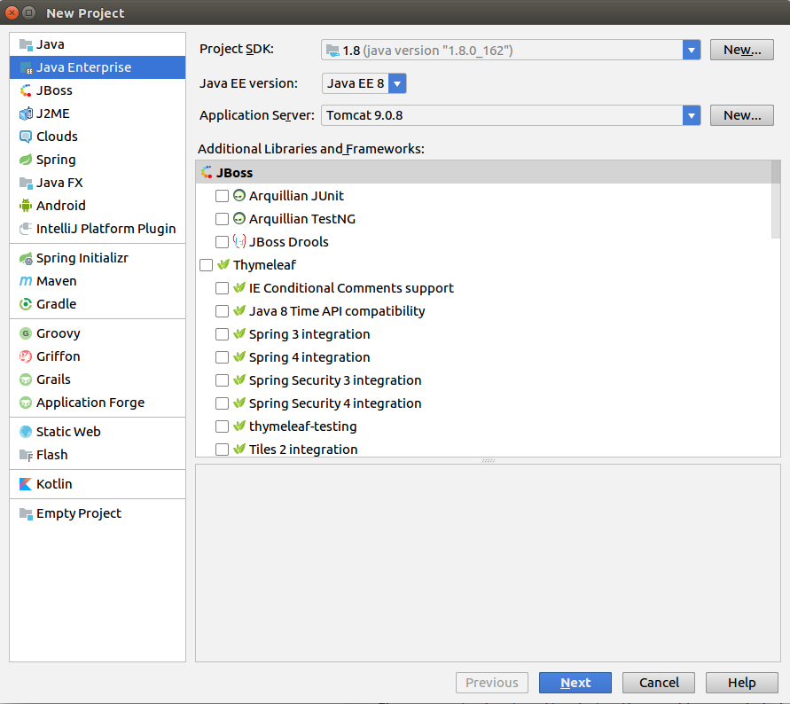
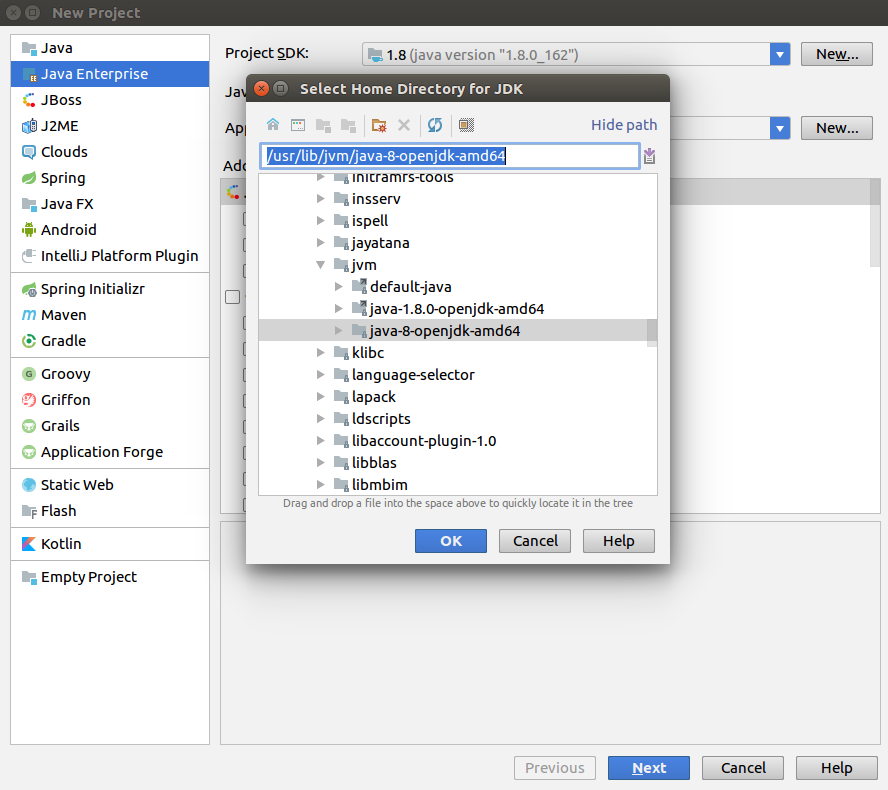
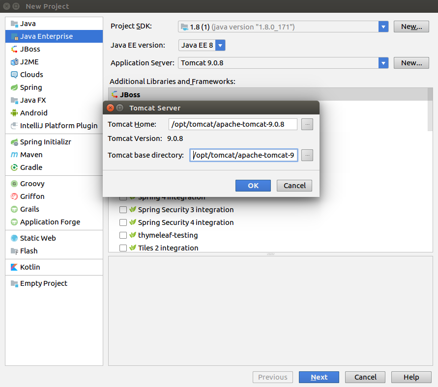
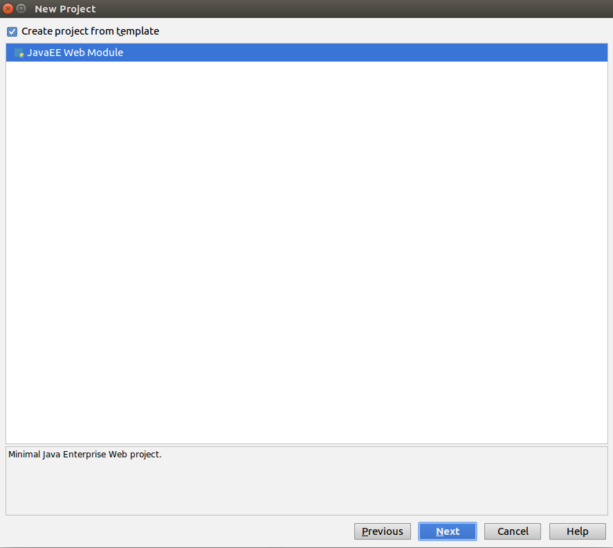
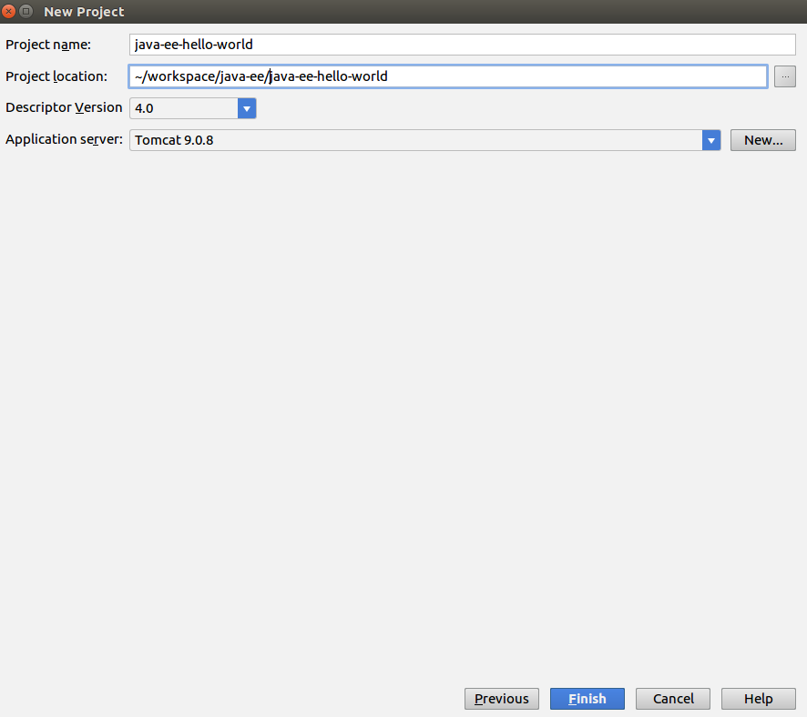
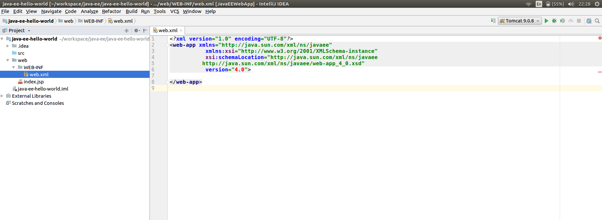
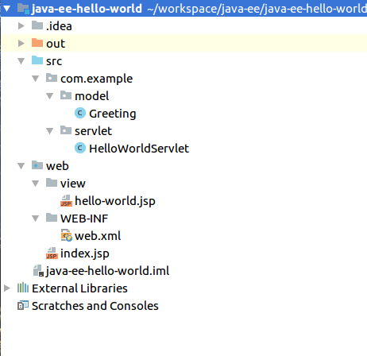
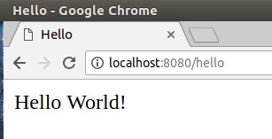

# Java EE: Servlets & JSP
En este documento se explica como implementar una aplicacion web utilizando las herramientas que provee Java EE, en particular con Servlets y JSPs.

## Requerimientos
Se requiere tener instalado:
 - [Java 8 SE](http://www.oracle.com/technetwork/java/javase/downloads/index.html)
 - [Tomcat 9](https://tomcat.apache.org/download-90.cgi)
 - No es un requisito, pero en este documento se explcaran los pasos utilizando el IDE [IntelliJ IDEA](https://www.jetbrains.com/idea/)

## 1. Crear el proyecto

En IntelliJ, ir a **_File->New->Proyect_** y elegir la opcion **_Java Enterprise_**.




Seleccionar el SDK 1.8, Java EE 8, y Tomcat 9. No es necesario ningun framework o libreria adicional.

En caso de no tener el SDK configurado, hacer click en **_New_** y elegir el directorio donde esta instalado Java.




En caso de no tener el Application Server configurado, hacer click en **_New->Tomcat Server_**,  y elegir tanto para **_Tomcat HOME_** como para **_Tomcat base directory_** el directorio donde esta instalado Tomcat.




Hacer click en **_Next_**, y en la siguiente pantalla tildar la opcion **_Create project from template_**, y elegir **_Java Web Module_**.




Hacer click en next **_Next_**, elegir un nombre y una ubicacion para el proyecto. Dejar los demas parametros por default, y hacer click en **_Finish_**




Finalmente, deberiamos tener un proyecto creado con la siguiente estructura:



## 2. Crear el modelo
El primer paso sera crear nuestro modelo de datos. Para esto, crear un nuevo paquete en el directorio `src` con el onmbre `com.example.model`, y dentro de este paquete crear una clase java con nombre `Greeting`. Esta clase tendra un unico atributo `message` de tipo `String`. Ademas, agregamos un constructor que reciba dicho parametro, y un getter.
```java
package com.example.model;

public class Greeting {

    private String message;
    
    public Greeting(String message) {
        this.message = message;
    }
    public String getMessage() {
        return message;
    }
}
```

## 3. Crear un Servlet
El siguiente paso sera crear un servlet para recibir un request HTTP GET. Primero, crear un nuevo paquete `com.example.servlet` (tambien dentro del directorio `src`), y dentro de este paquete crear una clase Java llamada `HelloWorldServlet`.
Para facilitar el desarrollo, agregar los siguientes imports a la clase:
```java
import com.example.model.Greeting;
import javax.servlet.*;
import javax.servlet.annotation.WebServlet;
import javax.servlet.http.*;
import java.io.IOException;
```
Luego debemos extender esta clase de `HttpServlet`, y overridear el metodo `doGet`
```java
public class HelloWorldServlet extends HttpServlet throws ServletException, IOException  {

    @Override
    public void doGet(HttpServletRequest req, HttpServletResponse resp) {

    }
}
````
Dentro del metodo `doGet`, agregar las siguientes lineas:
```java
Greeting greeting = new Greeting("Hello World!");
req.setAttribute("greeting", greeting);
RequestDispatcher view = req.getRequestDispatcher("view/hello-world.jsp");
view.forward(req, resp);
```
Esto crea un objeto `Greeting` con el mensaje **_Hello World!_**, y seteamos este objeto como un atributo dentro del request, con la clave **_greeting_**. Luego, obtenemos del request un `RequestDispatcher` que representa la vista a la cual enviaremos el request, y luego llamamos a `view.forward` para redirigir el request a la vista.

Por ultimo, debemos configurar la URL sobre la que estara escuchando el Servlet. Para eso, agregamos la siguiente Annotation sobre la cabezera de la clase:
```java
@WebServlet(urlPatterns = "/hello")
public class HelloWorldServlet extends HttpServlet {
...
}
```
De esta forma, el Servlet quedara escuchando en la direccion `/hello` del servidor.

## 4. Crear la JSP
El ultimo paso sera crear la vista para poder mostrar nuestro mensaje. En el directorio `web`, crear un nuevo directorio `view`, y dentro de este directorio crear un archivo JSP con nombre `hello-world.jsp`. Este archivo simplemente debe contener lo siguiente:
```html
<html>
<head>
    <title>Hello World</title>
</head>
<body>
    ${requestScope.greeting.message}
</body>
</html>
```
Lo que hacemos es obtener el atributo **_greeting_** que guardamos previamente en el request, y mostramos el mensaje del objeto.

La estructura del proyecto deberia haber quedado de la siguiente forma:



## 5. Ejecutar
Para ejecutar la aplicacion, simplemente hacer click en **_Run->Run 'Tomcat 9.0.8'_** (ya deberia estar creada la configuracion de ejecucion, la version puede no ser exactamente la misma). Una vez que levanto la aplicacion, en un explorador vamos a **_http://localhost:8080/hello_**, deberiamos ver nuestro mensaje **Hello World!**



