# ContabilidApp
ContabilidApp es una aplicación web que permite la carga de archivos de transacciones de usuarios, la descarga de esta información, y realizar controles sobre la misma.

# Índice  
- [Arquitectura](#architecture)
- [Instalación](#instalation)
    * [Pre-requisitos](#pre-requisites)
        + [Java 8](#java-8)
        + [Apache Tomcat](#apache-tomcat)
        + [Maven (opcional)](#maven)
        + [MySQL Cluster](#mysql-cluster)
    * [Configuración de la base de datos](#db-config)
    * [Configuración del Web Server](#web-config)
- [Deploy](#deploy)
- [Manual de usuario](#user-manual)

<a name="architecture"/>

# Arquitectura
La aplicación está desarrollada en Java EE, y utiliza Apache Tomcat como servidor web. La aplicación está distribuida en dos servidores: 
1. Un servidor frontend que maneja la vista de la aplicación. Este servidor utiliza el Java Server Faces (JSF) y PrimeFaces como frameworks de frontend para Java EE.
2. Un servidor backend que contiene la lógica de negocio y el modelo de datos. Este servidor utiliza Java Persistence API (JPA) y su implementación de Hibernate como frameworks para ORM (Object Relational Mapping).

A su vez, el servidor backend tiene una API REST para las distintas operaciones de negocio, y el servidor frontend consume dicha API para conectarse con el servidor backend.

Por último, como base de datos se utiliza MySQL Cluster, una base de datos distribuida que utiliza el motor de base de datos MySQL. Al ser distribuida, esta base de datos permite tener varios nodos de administración y almacenamiento de datos. Esto nos trae varios beneficios, como por ejemplo la posibilidad de escalar horizontalmente, contar con mayor disponibilidad, y evitar tener un single point of failure.

A continuación se muestra un diagrama de la arquitectura completa del sistema.

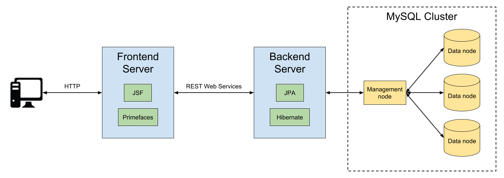


<a name="instalation"/>

# Instalación
Las siguientes instrucciones describen como realizar la instalación del sistema sobre Linux. 

<a name="pre-requisites"/>

## Pre-requisitos

<a name="java-8"/>

### Java 8
Para correr la aplicación, se debe tener instalado Java 8. Para instalarlo, simplemente ejecutar:
```sh
$ sudo apt-get install openjdk-8-jdk
```
Para verificar que Java 8 se instaló correctamente, ejecutar:
```sh
$ java -version
```
y se debería obtener un resultado similar al siguiente:
```sh
openjdk version "1.8.0_171"
OpenJDK Runtime Environment (build 1.8.0_171-8u171-b11-0ubuntu0.16.04.1-b11)
OpenJDK 64-Bit Server VM (build 25.171-b11, mixed mode)
```
Por último, debemos configurar la variable de entorno `JAVA_HOME`. Para eso, podemos agregar en el archivo `/etc/environment` la linea `JAVA_HOME="/usr/lib/jvm/java-8-openjdk-amd64"`, y actualizamos las variables de entorno ejecutando:
```sh
$ source /etc/environment
```

<a name="apache-tomcat"/>

### Apache Tomcat
Tanto el servidor frontend como el backend corren sobre Apache Tomcat. En este caso, utilizamos la version 9.0.10 de Tomcat, la cual puede ser descargada directamente del siguiente link: http://www.gtlib.gatech.edu/pub/apache/tomcat/tomcat-9/v9.0.10/bin/apache-tomcat-9.0.10.tar.gz, o desde: https://tomcat.apache.org/download-90.cgi.
Una vez realizada la descarga, extraer el contenido, crear un directorio en `/opt/tomcat` y mover el directorio `apache-tomcat-9.0.10` a este nuevo directorio:
```sh
$ tar -xvzf apache-tomcat-9.0.10.tar.gz
$ sudo mkdir /opt/tomcat
$ sudo mv apache-tomcat-9.0.10 /opt/tomcat/
```

<a name="maven"/>

### Maven (opcional)
Maven es requerido solo para poder compilar la aplicación desde el código fuente. En caso de que no se quiera hacer esto, se pueden directamente descargar los `.war` de los dos servidores ya compilados (más detalles sobre esto en la sección **Configuración del Web Server**). Estos `.war` están configurados para correr en una máquina local. Si se quiere distribuir el sistema en varias máquinas, se deberán cambiar las direcciones de los servidores y la DB en los parámetros de configuración de la app, y compilar nuevamente. 

Maven puede descargarse de https://maven.apache.org/download.cgi. Una vez descargado, extraer el contenido y moverlo a `/opt/maven`:
```sh
$ tar zxvf apache-maven-3.x.y.tar.gz
$ sudo mkdir /opt/maven
$ sudo mv apache-maven-3.x.y /opt/maven
```
Agregar en el `PATH` la dirección `/opt/maven/apache-maven-3.x.y/bin`. Para esto, abrir el archivo `/etc/environment`, y agregar `:/opt/maven/apache-maven-3.x.y/bin` al final de la linea del `PATH`. Finalmente, actualizar las variables de entorno ejecutando:
```sh
$ source /etc/environment
```
Para verificar la instalación, ejecutar:
```sh
$ mvn --version
```

<a name="mysql-cluster"/>

### MySQL Cluster
#### Pre-requisitos de MySQL Cluster
Para poder instalar MySQL Cluster, previamente se deben instalar algunas dependencias. Para empezar, ejecutar:
```sh
$ sudo apt-get install libaio1
```
En caso de no tener Python instalado, ejecutar:
```sh
$ sudo apt-get install python2.7
```
Verificar la instalación de Python con:
```sh
$ python --version
```
Luego se deben instalar algunos paquetes de Python. En caso de no tener pip instalado, ejecutar:
```sh
$ sudo apt-get install python-pip
```
Y luego descargar los siguientes paquetes de Python con pip:
```sh
$ pip install paramiko
$ pip install pycrypto
```
#### Instalación de MySQL Cluster
(Las instrucciones oficiales pueden encontrarse en: https://downloads.mysql.com/tutorials/cluster/mysql_wp_cluster_quickstart.pdf y https://dev.mysql.com/doc/refman/5.7/en/mysql-cluster-install-auto-using.html)

MySQL Cluster puede descargarse desde: https://dev.mysql.com/downloads/cluster/. Seleccionar la opción **Linux - Generic**, elegir la arquitectura del sistema, y hacer click en **Download**.

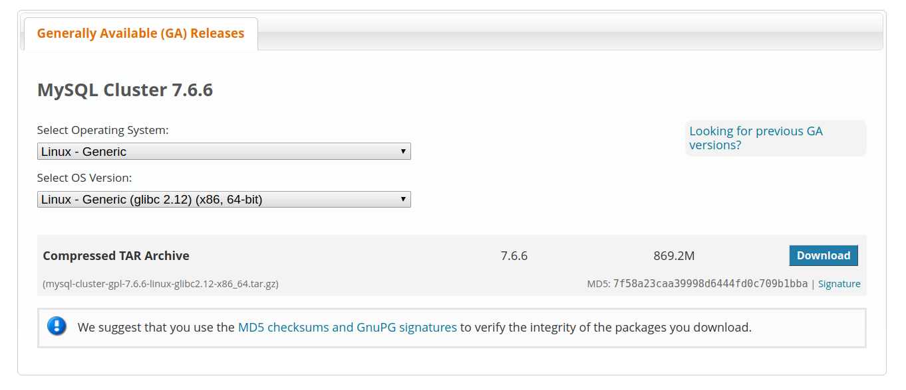

Una vez descargado, extraer el directorio y moverlo a `/usr/local/mysql`
```sh
$ tar -xvzf mysql-cluster-gpl-7.6.6-linux-glibc2.12-x86_64.tar.gz
$ mv mysql-cluster-gpl-7.6.6-linux-glibc2.12-x86_64 mysql
$ sudo mv mysql /usr/local
```
Una vez hecho esto, ir al directorio `/usr/local/mysql` y ejecutar `bin/ndb_setup.py`:
```sh
$ cd /usr/local/mysql
$ bin/ndb_setup.py
```
Esto abrirá en un browser la URL https://localhost:8081/welcome.html. En caso de no abrirse automáticamente, copiar la URL y abrirla manualmente desde un browser. Esto iniciará el Wizard para la instalación de MySQL Cluster.

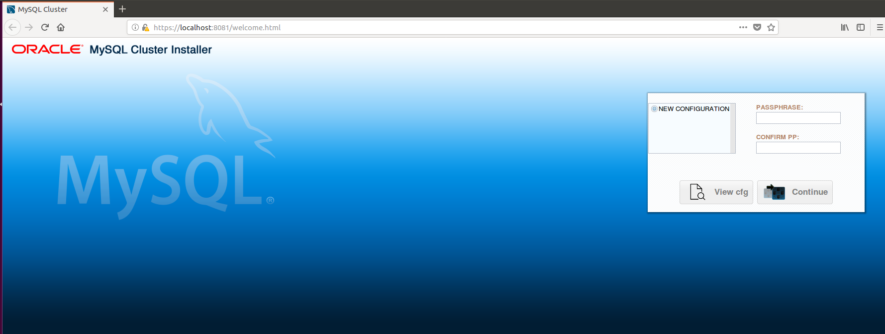

Aquí podemos crear una nueva configuración para nuestro cluster y deployarlo. Comenzamos seleccionando **NEW CONFIGURATION**, y seteando una Passphrase para nuestro cluster (por ejemplo: 'mysql'). Luego hacemos click en **Continue**.

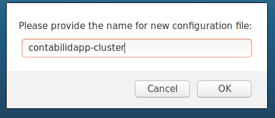

Ahora elegimos un nombre para nuestro cluster (por ejemplo: 'contabilidapp-cluster'), y hacemos click en **OK**.

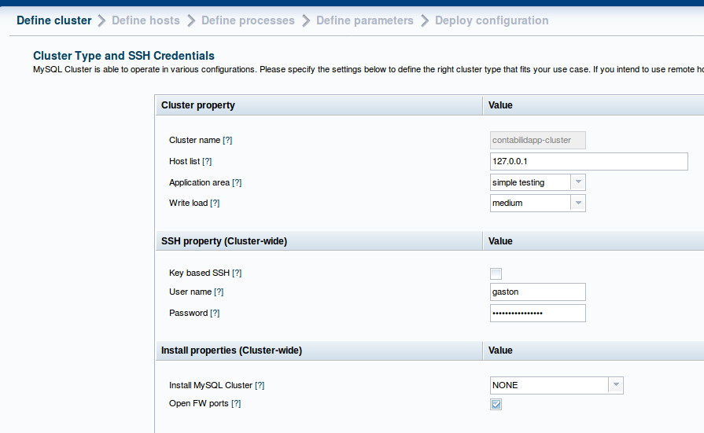

En esta pantalla podemos especificar los hosts que utilizaremos para nuestro cluster. Como en este ejemplo lo estamos corriendo de forma local, solo especificamos un host: 127.0.0.1, pero podrían agregarse más hosts separados por coma. Podemos especificar el tipo de aplicación y la carga de escritura (en este caso dejamos las opciones por default). En la sección de **SSH property** especificamos el usuario y password que se utilizará para la conexión al host (en este caso usamos el usuario y password de la máquina local). Finalmente, podemos elegir abrir los puertos de Firewall para la  aplicación. Luego de todo esto, hacemos click en **Save&Next**.

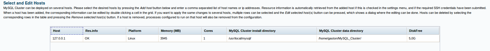

En la siguiente pantalla podemos visualizar los hosts que se utilizarán para el cluster. Si quisieramos, podemos agregar o quitar hosts, o editar la configuración de cada uno. Hacemos click en **Save&Next**.

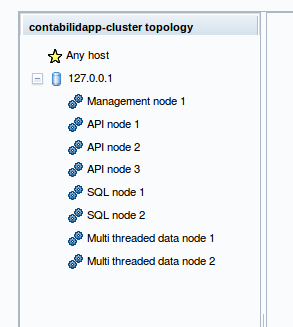

En esta pantalla podemos visualizar los nodos que se crearán en cada host. Si queremos podemos agregar o quitar nodos en cada host. Nuevamente, dejamos la configuración por defecto, que en particular utiliza un management node, y dos multithreaded data nodes. Para más información sobre los distintos nodos de MySQL Cluster, ver: https://dev.mysql.com/doc/refman/5.7/en/mysql-cluster-basics.html. Hacemos click en **Save&Next**.

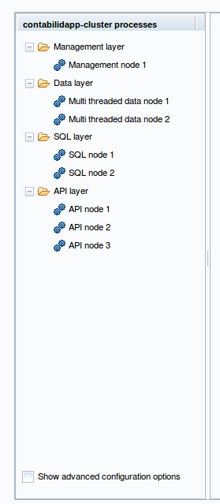

En esta pantalla vemos cómo quedarían las distintas capas correspondientes a los distintos tipos de nodos en cada host. Si hacemos click en **Show advanced configuration options**, y nos paramos sobre algún Layer o nodo, podemos editar algunos parámetros de configuración, como por ejemplo la cantidad de memoria a asignar a cada nodo. Dejamos las configuraciones por default, y hacemos click en **Save&Next**.

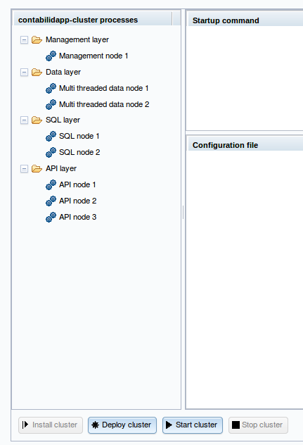

En esta última pantalla, podemos deployar e iniciar nuestro cluster. Hacemos click en **Deploy cluster**, y deberíamos obtener el siguiente mensaje:

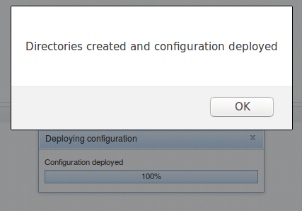

Luego, hacemos click en **Start cluster**, y deberíamos obtener el siguiente mensaje:

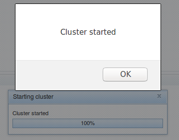

Una vez hecho esto, ya tenemos corriendo un MySQL Cluster en nuestra máquina. Para monitorear el cluster, podemos ejecutar desde `/usr/local/mysql/`:
```sh
$ bin/ndb_mgm -e show
```
Esto nos mostrará el estado de los distintos nodos corriendo en nuestro host. Deberíamos ver algo como esto:
```sh
Connected to Management Server at: localhost:1186
Cluster Configuration
---------------------
[ndbd(NDB)]	2 node(s)
id=1	@127.0.0.1  (mysql-5.7.22 ndb-7.6.6, Nodegroup: 0, *)
id=2	@127.0.0.1  (mysql-5.7.22 ndb-7.6.6, Nodegroup: 0)

[ndb_mgmd(MGM)]	1 node(s)
id=49	@127.0.0.1  (mysql-5.7.22 ndb-7.6.6)

[mysqld(API)]	5 node(s)
id=53	@127.0.0.1  (mysql-5.7.22 ndb-7.6.6)
id=54	@127.0.0.1  (mysql-5.7.22 ndb-7.6.6)
id=231 (not connected, accepting connect from 127.0.0.1)
id=232 (not connected, accepting connect from 127.0.0.1)
id=233 (not connected, accepting connect from 127.0.0.1)
```

<a name="db-config"/>

## Configuración de la base de datos
### Credenciales
Una vez levantado el MySQL Cluster, debemos configurar el usuario y password que usaremos para conectarnos desde nuestra Web App. Para entrar a la base de datos, ejecutar desde `/usr/local/mysql/`:
```sh
$ bin/mysql -h 127.0.0.1 -P 3306 -u root
```
Una vez conectado a la base de datos, ejecutar:
```sh
mysql> use mysql;
mysql> update user set authentication_string=password('mysql') where user='root';
mysql> flush privileges;
mysql> quit;
```
Esto setea la password 'mysql' para el usuario 'root', que son las credenciales que utilizaremos para conectarnos desde nuestra app. A partir de ahora, si queremos conectarnos a la base de datos, debemos ejecutar:
```sh
$ bin/mysql -h 127.0.0.1 -P 3306 -u root -p
```
y tipear la password 'mysql'.

### Cargar schema
Ahora cargaremos el schema de la base de datos que usaremos en nuestra aplicación. Para eso, descargar el schema de https://raw.githubusercontent.com/gsnaider/7574-sistemas-distribuidos-i/master/tp-final/deploy-files/contabilidapp_schema.sql:
```sh
$ wget https://raw.githubusercontent.com/gsnaider/7574-sistemas-distribuidos-i/master/tp-final/deploy-files/contabilidapp_schema.sql
```
Luego, desde `/usr/local/mysql/` ejecutar:
```sh
$ bin/mysql -h 127.0.0.1 -P 3306 -u root -p < contabilidapp_schema.sql
```
y tipear la password 'mysql'. Luego de esto, se debería haber cargado el schema de la base de datos. Para verificarlo, entrar a la base de datos y ejecutar lo siguiente:
```sh
$ bin/mysql -h 127.0.0.1 -P 3306 -u root -p
mysql> SHOW DATABASES;
mysql> USE contabilidapp;
mysql> SHOW TABLES;
```
Deberiamos ver la database `contabilidapp`, y las siguientes tablas:
```sql
+--------------------------+
| Tables_in_contabilidapp  |
+--------------------------+
| CLIENTS                  |
| INPUT_FILES              |
| INPUT_FILES_TRANSACTIONS |
| TRANSACTIONS             |
| UPLOAD_PERIODS           |
+--------------------------+
```

<a name="web-config"/>

## Configuración del Web Server
Para configurar el servidor web, simplemente descargamos los archivos `.war` del servidor frontend (`contabilidapp.war`) y backend (`contabilidapp-backend.war`), y los movemos al directorio `webapps` de Tomcat:
```sh
$ wget https://github.com/gsnaider/7574-sistemas-distribuidos-i/raw/master/tp-final/deploy-files/contabilidapp.war
$ wget https://github.com/gsnaider/7574-sistemas-distribuidos-i/raw/master/tp-final/deploy-files/contabilidapp-backend.war
$ sudo mv contabilidapp.war /opt/tomcat/apache-tomcat-9.0.10/webapps/
$ sudo mv contabilidapp-backend.war /opt/tomcat/apache-tomcat-9.0.10/webapps/
```
Alternativamente, si queremos generar los `.war` desde el código fuente, podemos descargar el código del servidor frontend desde https://github.com/gsnaider/7574-sistemas-distribuidos-i/tree/master/tp-final/contabilidapp, y el del backend desde https://github.com/gsnaider/7574-sistemas-distribuidos-i/tree/master/tp-final/contabilidapp-backend. Luego, en cada uno de estos directorios, ejecutar:
```sh
$ mvn package
```
y copiar los `.war` generados en el directorio `target` a `/opt/tomcat/apache-tomcat-9.0.10/webapps/`.

En este caso, como corremos el servidor en una única máquina, podemos usar los `.war` descargados del repositorio. Sin embargo, si quisieramos distribuir los servidores en dos máquinas, deberíamos cambiar los parámetros de las conexiones en `contabilidapp/src/main/webapp/WEB-INF/web.xml` (para la conexión con el servidor backend), y en `contabilidapp-backend/src/main/resources/META-INF/persistence.xml` (para la conexión con la DB), y compilar el código con Maven.

<a name="deploy"/>

# Deploy
Para deployar la aplicación, desde el directorio `/opt/tomcat/apache-tomcat-9.0.10` ejecutar:
```sh
$ bin/startup.sh
```
Esto levanta tanto el servidor frontend como el backend (ya que en este ejemplo ambos corren en la misma máquina bajo el mismo tomcat).
Para frenar el servidor, ejecutar:
```sh
$ bin/shutdown.sh
```
Para monitorear los logs, ejecutar:
```sh
$ tail 'f logs/catalina.out
```
Una vez levantada la aplicación, en un browser ir a http://localhost:8080/contabilidapp y verificar que la app levantó correctamente.

<a name="user-manual"/>

# Manual de usuario
A continuación se explica como utilizar la app ContabilidApp.

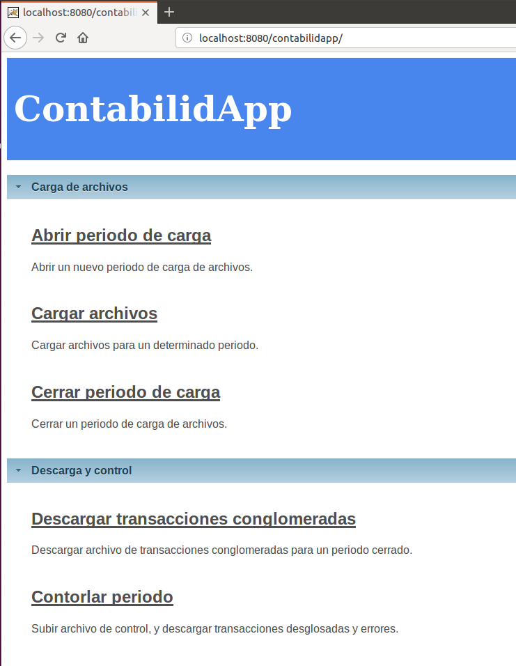

En la primer pantalla vemos las diferentes acciones que podemos realizar en la aplicación. Comenzamos haciendo click en **Abrir periodo de carga**.

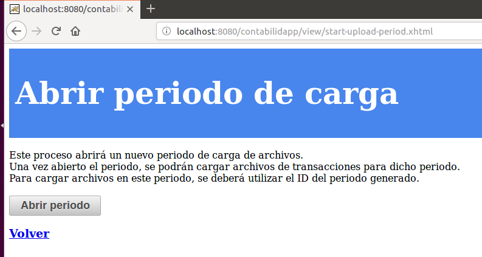

En esta pantalla, podemos comenzar un nuevo periodo de carga, lo cual nos permitirá cargar archivos de transacciones para ese periodo, y luego cerrarlo. Al hacer click en **Abrir periodo** deberíamos ver una pantalla como esta:


El ID generado nos permitirá elegir este periodo para la carga de archivos y demás operaciones.

Si volvemos al menu principal, y elegimos **Cargar archivos**, pasamos a una pantalla como esta:

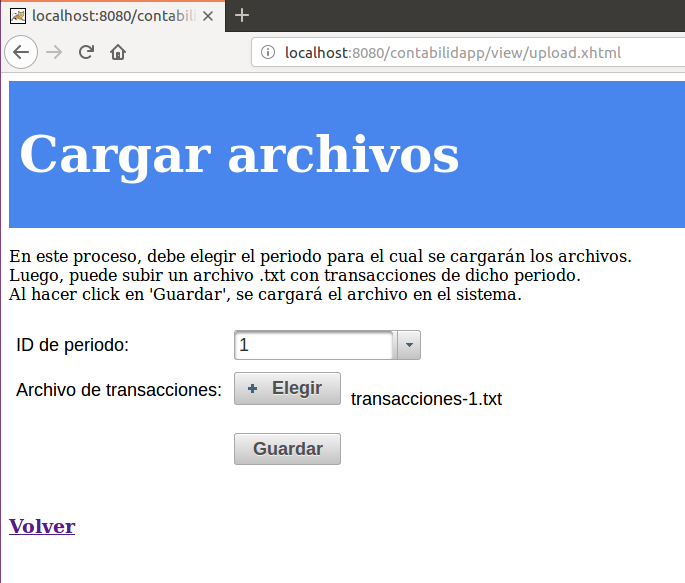

Aquí podemos elegir el periodo previamente abierto, y cargar uno o varios archivos de transacciones. Una vez cargados los archivos, hacemos click en **Volver**.

Ahora pasamos a la pantalla de **Cerrar periodo de carga**

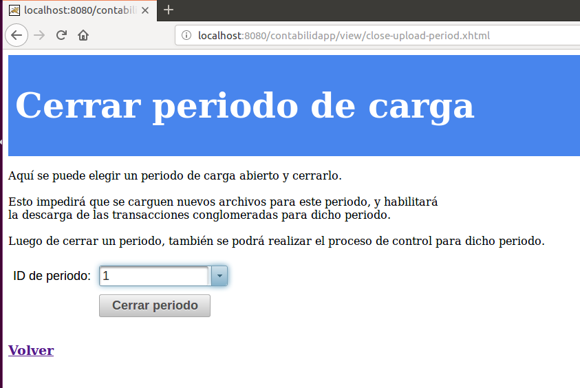

En esta pantalla, podemos cerrar un periodo para bloquear la carga de nuevos archivos en ese periodo. Luego de esto, podremos descargar las transacciones de dicho periodo, y realizar controles.

En el menu principal ahora elegimos **Descargar transacciones conglomeradas**

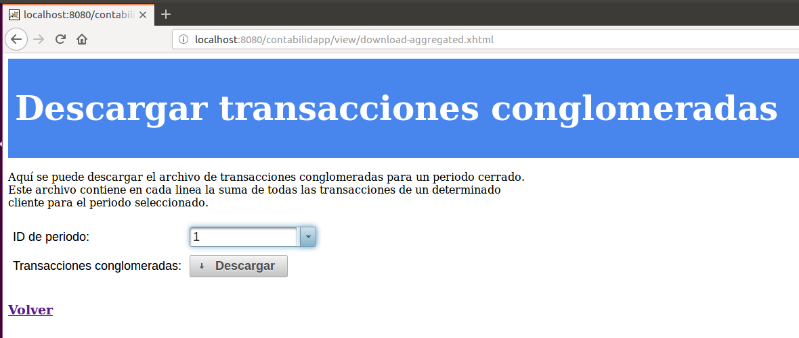

Aquí podemos elegir un periodo ya cerrado, y descargar un archivo de todas las transacciones de dicho periodo, conglomeradas por cliente.

Finalmente, en el menu principal podemos ir a **Controlar periodo**

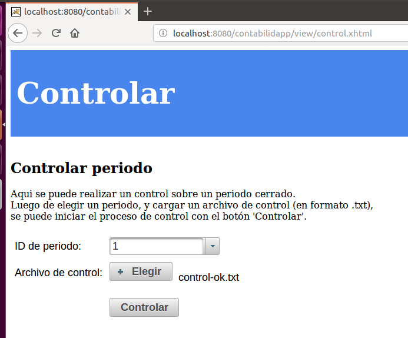

En esta pantalla, podemos elegir un periodo cerrado, y subir un archivo de control. Al hacer click en **Controlar**, se podrán descargar las transacciones desglosadas para ese control, y los errores (en caso de haberlos):

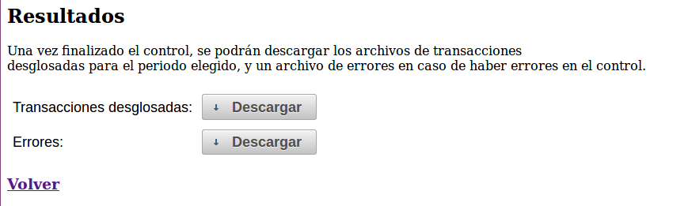

