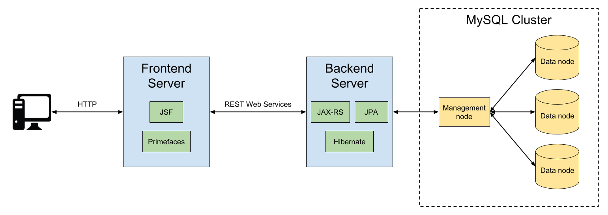

# ContabilidApp
ContabilidApp es una aplicación web que permite la carga de archivos de transacciones de usuarios, la descarga de esta información, y realizar controles sobre la misma.

## Arquitectura
La aplicación está desarrollada en Java EE, y utiliza Apache Tomcat como servidor web. La aplicación está distribuida en dos servidores: 
1. Un servidor frontend que maneja la vista de la aplicación. Este servidor utiliza el Java Server Faces (JSF) y PrimeFaces como frameworks de frontend para Java EE.
2. Un servidor backend que contiene la lógica de negocio y el modelo de datos. Este servidor utiliza Java Persistence API (JPA) y su implementación de Hibernate como frameworks para ORM (Object Relational Mapping).

A su vez, el servidor backend tiene una API REST para las distintas operaciones de negocio, y el servidor frontend consume dicha API para conectarse con el servidor backend.

Por último, como base de datos se utiliza MySQL Cluster, una base de datos distribuida que utiliza el motor de base de datos MySQL. Al ser distribuida, esta base de datos permite tener varios nodos de administración y almacenamiento de datos. Esto nos trae varios beneficios, como por ejemplo la posibilidad de escalar horizontalmente, contar con mayor disponibilidad, y evitar tener un single point of failure.

A continuación se muestra un diagrama de la arquitectura completa del sistema.

